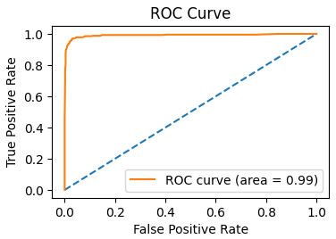

Churn Prediction
========
A notebook for predicting which customers are going to churn (i.e. when customers stop using a product/service). The dataset used is highly imbalanced and contains information about a bank's customers, including whether the customer left the bank by closing their account or stayed with the bank and remained a customer.

